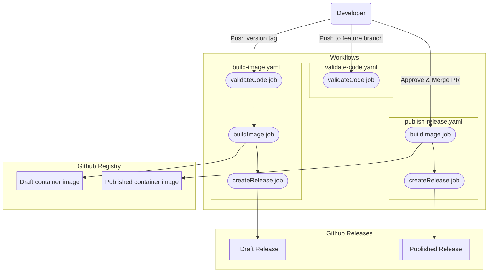

# GitHub Actions Workflows Documentation

This directory contains GitHub Actions workflows for CI/CD automation of the `concourse-netbox-resource` project. The workflows provide code validation, image building and release management.

## TOC
- [GitHub Actions Workflows Documentation](#github-actions-workflows-documentation)
  - [TOC](#toc)
  - [Overview](#overview)
  - [Workflow Details](#workflow-details)
    - [Validate Code Workflow](#validate-code-workflow)
      - [Jobs and Steps](#jobs-and-steps)
    - [Build Image Workflow](#build-image-workflow)
      - [Jobs and Steps](#jobs-and-steps-1)
    - [Publish Release Workflow](#publish-release-workflow)
      - [Jobs and Steps](#jobs-and-steps-2)
  - [Environment Variables](#environment-variables)
  - [Container Images](#container-images)
  - [Workflow vizualization](#workflow-vizualization)
  - [Release Process](#release-process)
  - [Dependencies](#dependencies)

## Overview

The project uses three main workflows that work together to ensure code quality and automate releases:

| | |
| :--- | :--- |
| [Validate Code workflow](#validate-code-workflow) | Validates code quality on feature branches |
| [Build Image workflow](#build-image-workflow) | Builds draft releases when tags are pushed |
| [Publish Release workflow](#publish-release-workflow) | Publishes final releases when merged to master |

## Workflow Details

### Validate Code Workflow

| | |
| :--- | :--- |
| **File** | [`validate-code.yaml`](./validate-code.yaml) |
| **Trigger** | Push to any branch except `master` |
| **Purpose** | Ensures code quality by running tests |

#### Jobs and Steps
- **validateCode:**
  - Checks out code
  - Populates environment variables (`GIT_COMMIT`, `GIT_TAG`, `BUILD_DATE`, `LDFLAGS`, `GO_VERSION`)
  - Sets up Go using the version from [go.mod](../../go.mod)
  - Runs [golangci-lint](https://github.com/golangci/golangci-lint) for static code analysis
  - Runs [govulncheck](https://pkg.go.dev/golang.org/x/vuln/cmd/govulncheck) for vulnerability scanning
  - Executes unit tests and showing the coverage ratio
  - Builds all three binaries (`check`, `in`, `out`)
  - Validates that built binaries report correct version information

### Build Image Workflow

| | |
| :--- | :--- |
| **File** | [`build-image.yaml`](./build-image.yaml) |
| **Trigger** | Push to tags matching `v*` pattern |
| **Purpose** | Creates a draft release pointing to the container image |

#### Jobs and Steps
- **validateCode:**
  - same as in [Validate Code Workflow](#validate-code-workflow)
  - Additional validation to ensure a valid git tag exists

- **buildImage:**
  - depends on the `validateCode` job
  - Logs into GitHub Container Registry (GHCR)
  - Generates Docker metadata with multiple tag strategies:
    - semantic versioning (`v1.2.3`, `v1.2`)
    - draft tag
    - date based
  - Builds and pushes `linux/amd64` Docker image
  - Injects build arguments (`GO_VERSION`, `GIT_COMMIT`, `GIT_TAG`, `BUILD_DATE`)

- **createRelease:**
  - depends on the `buildImage` job
  - uses [mdq](https://github.com/yshavit/mdq) to extract the relevant changelog section for the tag
  - Appends Docker pull command to changelog
  - Creates a **draft** GitHub release with the processed changelog

### Publish Release Workflow

| | |
| :--- | :--- |
| **File** | [`publish-release.yaml`](./publish-release.yaml) |
| **Trigger** | Push to `master` branch |
| **Purpose** | Publishes the release |

#### Jobs and Steps
- **buildImage:**
  - Similar to build-image workflow but with key differences:
    - Uses `release` tag instead of `draft`
    - Requires an existing git tag on the commit

- **createRelease:**
  - depends on the `buildImage` job
  - Same changelog processing as in the [Build Image workflow](#build-image-workflow)
  - Removes draft status from the release to publish it
  - Updates existing releases only if they are unreleased

## Environment Variables

All workflows populate and use these key environment variables:

| Variable | Description | Example |
|----------|-------------|---------|
| `GIT_COMMIT` | Current commit SHA | `abc123def456...` |
| `GIT_TAG` | Git tag pointing to commit | `v1.2.3` or `undefined` |
| `BUILD_DATE` | UTC timestamp in RFC3339 format | `2024-01-15T10:30:00Z` |
| `GO_VERSION` | Go version from go.mod | `1.25.1` |
| `LDFLAGS` | Linker flags for version injection | `-X 'pkg/helper.gitCommit=...'` |

## Container Images

Images are built and pushed to GitHub Container Registry (GHCR) with the following naming pattern:

| | |
| :--- | :--- |
| **Draft release** | `ghcr.io/sapcc/concourse-netbox-resource:draft` |
| **Published release** | `ghcr.io/sapcc/concourse-netbox-resource:release` |
| **Semantic version** | `ghcr.io/sapcc/concourse-netbox-resource:v1.2.3` |
| **Timestamp** | `ghcr.io/sapcc/concourse-netbox-resource:YYYYMMDD-hhmmss` |
| **Latest** | `ghcr.io/sapcc/concourse-netbox-resource:latest` |
| **Branch** | `ghcr.io/sapcc/concourse-netbox-resource:branch_name` |

## Workflow vizualization

## Release Process

The complete release process follows this flow:

1. **Development:**
   - Work on feature branches, all pushes trigger the [Validate Code workflow](#validate-code-workflow)
2. **Tag Creation:**
   - Create a version tag (e.g., `v1.2.3`) which triggers the [Build Image workflow](#build-image-workflow)
     - Builds and pushes container image with draft tags
     - Creates draft release
3. **PR Review:**
   - Review and approve the pull request
4. **Merge:**
   - Merge the approved changes to the `master` branch
   -  this triggers the [Publish Release workflow](#publish-release-workflow)
        - Builds and pushes container image with release tags
        - Publishes the release (removes draft status)

## Dependencies

- **Actions Used:**
  - `actions/checkout@v5.0.0` - Code checkout
  - `actions/setup-go@v6.0.0` - Go environment setup
  - `golangci/golangci-lint-action@v8.0.0` - Static analysis
  - `docker/login-action@v3.6.0` - Container registry authentication
  - `docker/metadata-action@v5.8.0` - Docker metadata generation
  - `docker/build-push-action@v6.18.0` - Container building and pushing
  - `ncipollo/release-action@v1.20.0` - GitHub release creation

- **External Tools:**
  - [golangci-lint](https://github.com/golangci/golangci-lint) for static code analysis
  - [govulncheck](https://pkg.go.dev/golang.org/x/vuln/cmd/govulncheck) Go vulnerability scanner
  - [mdq](https://github.com/yshavit/mdq) Markdown query tool for changelog processing
