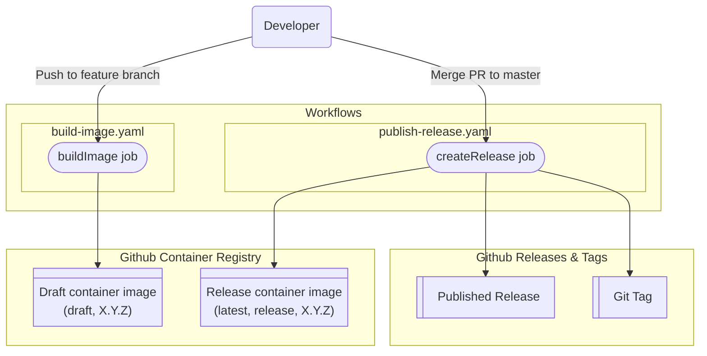

# GitHub Actions Workflows Documentation

This directory contains GitHub Actions workflows for CI/CD automation of the `concourse-netbox-resource` project. The workflows provide code validation, image building and release management.

## TOC
- [GitHub Actions Workflows Documentation](#github-actions-workflows-documentation)
  - [TOC](#toc)
  - [Overview](#overview)
  - [Workflow Details](#workflow-details)
    - [Build Image Workflow](#build-image-workflow)
      - [Jobs and Steps](#jobs-and-steps)
    - [Publish Release Workflow](#publish-release-workflow)
      - [Jobs and Steps](#jobs-and-steps-1)
  - [Environment Variables](#environment-variables)
  - [Container Images](#container-images)
  - [Workflow vizualization](#workflow-vizualization)
  - [Release Process](#release-process)
  - [Dependencies](#dependencies)

## Overview

The project uses two main workflows that work together to ensure code quality and automate releases:

| | |
| :--- | :--- |
| [Build Image workflow](#build-image-workflow) | Validates code and builds draft images on feature branches |
| [Publish Release workflow](#publish-release-workflow) | Builds images and publishes releases when merged to master |

## Workflow Details

### Build Image Workflow

| | |
| :--- | :--- |
| **File** | [`build-image.yaml`](./build-image.yaml) |
| **Trigger** | Push to any branch except `master`, excluding `.github` paths |
| **Purpose** | Validates code quality, builds draft container image, and ensures version consistency |

#### Jobs and Steps
- **buildImage:**
  - Checks out code with full history (fetch-depth: 0)
  - Installs [mdq](https://github.com/yshavit/mdq) tool for changelog parsing
  - Populates environment variables:
    - `BUILD_DATE` - Current UTC timestamp
    - `GIT_COMMIT` - Current commit SHA
    - `GIT_TAG` - Version extracted from CHANGELOG.md
    - `LDFLAGS` - Go linker flags for version injection
    - `GO_VERSION` - Go version from go.mod
  - Validates environment variables:
    - Verifies version format matches `X.Y.Z` pattern (e.g., `1.2.3`)
    - Checks that the git tag doesn't already exist
  - Sets up Go using version from go.mod
  - Runs [golangci-lint](https://github.com/golangci/golangci-lint) v2.4.0 for static code analysis
  - Runs [govulncheck](https://pkg.go.dev/golang.org/x/vuln/cmd/govulncheck) for vulnerability scanning
  - Executes unit tests with coverage reporting
  - Builds the `check` binary with version information
  - Validates that built binary reports correct version for all commands (`check`, `in`, `out`)
  - Logs into GitHub Container Registry (GHCR)
  - Generates Docker metadata with tags:
    - Version tag (e.g., `1.2.3`)
    - `draft` tag
  - Builds and pushes `linux/amd64` Docker image with build arguments:
    - `BUILDER_VERSION` - Go builder image version
    - `GIT_COMMIT` - Current commit SHA
    - `GIT_TAG` - Version from changelog
    - `BUILD_DATE` - Build timestamp

### Publish Release Workflow

| | |
| :--- | :--- |
| **File** | [`publish-release.yaml`](./publish-release.yaml) |
| **Trigger** | Push to `master` branch, excluding `.github` paths |
| **Purpose** | Builds the release container image, publishes a Github release and creates git tag |

#### Jobs and Steps
- **createRelease:**
  - Checks out code
  - Installs [mdq](https://github.com/yshavit/mdq) tool for changelog parsing
  - Populates environment variables:
    - `GIT_TAG` - Version extracted from CHANGELOG.md
    - `GIT_COMMIT` - Current commit SHA
  - Validates environment variables:
    - Verifies version format matches `X.Y.Z` pattern
    - Checks that the git tag doesn't already exist
  - Sets up Go using version from go.mod
  - Logs into GitHub Container Registry (GHCR)
  - Generates Docker metadata with tags:
    - version tag (e.g., `1.2.3`)
    - `release` tag
    - `latest` tag
  - Builds and pushes `linux/amd64` Docker image with build argument:
    - `BUILDER_VERSION` - Go builder image version
    - `GIT_COMMIT` - Current commit SHA
    - `GIT_TAG` - Version from changelog
    - `BUILD_DATE` - Build timestamp
  - Processes changelog:
    - Extracts changelog section for the current version using mdq
    - Appends Docker pull command to changelog
  - Creates GitHub release using [ncipollo/release-action](https://github.com/ncipollo/release-action):
    - Uses processed changelog as release body
    - Sets `makeLatest: "legacy"` for latest release handling
    - Skips if release already exists
    - Updates only unreleased releases
  - Creates and pushes git tag:
    - Configures git user
    - Creates annotated tag with changelog content
    - Pushes tag to origin

## Environment Variables

The workflows populate and use these key environment variables:

| Variable | Description | Example |
|----------|-------------|---------|
| `GIT_COMMIT` | Current commit SHA | `abc123def456...` |
| `GIT_TAG` | Version extracted from CHANGELOG.md | `1.2.3` |
| `BUILD_DATE` | UTC timestamp in RFC3339 format | `2024-01-15T10:30:00Z` |
| `GO_VERSION` | Go version from go.mod | `1.25.1` |
| `LDFLAGS` | Linker flags for version injection | `-X 'github.com/sapcc/concourse-netbox-resource/internal/helper.gitCommit=...'` |

## Container Images

Images are built and pushed to GitHub Container Registry (GHCR) with the following tags:

| Tag | Description | Workflow |
| :--- | :--- | :--- |
| `ghcr.io/sapcc/concourse-netbox-resource:draft` | Draft image from feature branches | Build Image |
| `ghcr.io/sapcc/concourse-netbox-resource:release` | Released image from master | Publish Release |
| `ghcr.io/sapcc/concourse-netbox-resource:1.2.3` | Semantic version tag | Both |

All images are built for the `linux/amd64` platform.

## Workflow vizualization

## Release Process

The complete release process follows this flow:

1. **Development:**
   - Work on feature branches
   - All pushes to non-master branches trigger the [Build Image workflow](#build-image-workflow)
   - This workflow validates code quality, runs tests, and builds a draft container image
   - The version is extracted from CHANGELOG.md and validated

2. **PR Review:**
   - Create a pull request to merge changes into `master`
   - Review and approve the pull request

3. **Merge & Release:**
   - Merge the approved changes to the `master` branch
   - This triggers the [Publish Release workflow](#publish-release-workflow) which:
     - Builds and pushes the release container image
     - Creates a GitHub release with the changelog
     - Creates and pushes a git tag for the version

## Dependencies

- **Actions Used:**
  - `actions/checkout@v5.0.0` - Code checkout
  - `actions/setup-go@v6.0.0` - Go environment setup
  - `golangci/golangci-lint-action@v8.0.0` - Static analysis
  - `docker/login-action@v3.6.0` - Container registry authentication
  - `docker/metadata-action@v5.8.0` - Docker metadata generation
  - `docker/build-push-action@v6.18.0` - Container building and pushing
  - `ncipollo/release-action@v1.20.0` - GitHub release creation

- **External Tools:**
  - [golangci-lint](https://github.com/golangci/golangci-lint) for static code analysis
  - [govulncheck](https://pkg.go.dev/golang.org/x/vuln/cmd/govulncheck) Go vulnerability scanner
  - [mdq](https://github.com/yshavit/mdq) Markdown query tool for changelog processing
